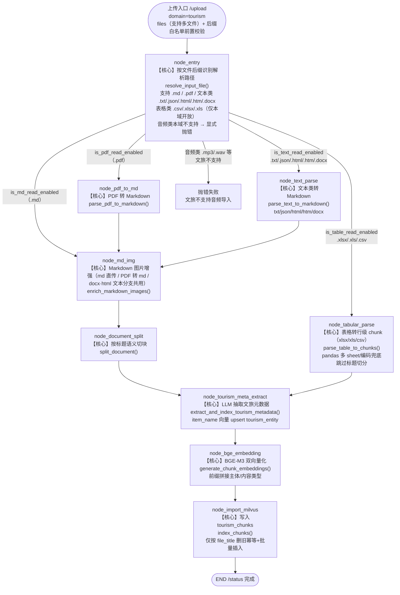

# 导入模块深度解析 —— 文旅知识注入流水线

> 本文档**代码驱动**：所有节点名、函数名、集合名均出自 `app/process/{domain}_import/`、`../app/rag/common`、`app/rag/{domain}_import/`、`../app/api/http/import_server.py`。
> 编排框架：LangGraph（`StateGraph`）。导入流水线编译为 `kb_tourism_import_app`。

---

## 第一部分：流程架构图

### A-1 文旅导入流水线（kb_tourism_import_app，9 节点，含表格分支）



## 第二部分：深度技术解析

> 节点按实际执行顺序组织；公共阶段（入口/解析/切分/向量化）共用 `rag/common/` 同一份实现，元数据抽取与入库独立。

---

### 阶段 0：HTTP 网关与异步任务调度

**涉及文件**：`../app/api/http/import_server.py`

**节点行为**：
1. `POST /upload`：接收多文件（form-data 的 `files` + `domain`），逐文件做**后缀白名单前置校验**（`{".pdf",".md"} | SUPPORTED_TEXT_EXTENSIONS | SUPPORTED_TABLE_EXTENSIONS | SUPPORTED_UPLOAD_IMAGE_EXTENSIONS`），不支持的直接标记失败不启动任务；**图片文件（jpg/jpeg/png/webp/bmp）在保存落盘后、启动导入图前先经视觉模型前置转写**（`rag/common/image_ocr_service.transcribe_image_to_md`，qwen3-vl-flash，单图 ≤7MB）：原样提取图中文字 + 画面描述，写成同目录同名 `.md` 后交导入图 md 分支，导入图零改动。转写**必须放在领域预检之前**——blocked 挂起时暂存的已是 md 路径，confirm 强制放行重跑才不会把 .jpg 直接喂给导入图；
2. 按 `output/YYYYMMDD/{task_id}/` 目录落盘（按日期 + 任务 ID 双层隔离，防重名）；
3. 为每个文件生成 UUID `task_id`，并在启动后台任务前执行**领域误导预检**（`rag/common/domain_guard_service.py`）：单域模式下恒放行，保留入口供后续扩展；
4. `POST /upload/confirm/{task_id}`：blocked 任务的人工裁决入口，body `{"action":"run"}` 强制放行（交回 `run_graph_task` 正常导入）、`{"action":"cancel"}` 取消（删除暂存文件并清任务）；`run_graph_task` 内：清 `error` → `update_task_status(pending→processing→completed/failed)` → `resolve_import_domain`（**仅接受 tourism，非法值抛错**）→ 按域选图（`_IMPORT_GRAPH_MAP`）→ `state_factory()` 建默认状态并注入任务参数 → `import_app.stream(init_state)` **流式执行**，每个完成的节点名追加进内存 done_list；
5. `GET /status/{task_id}`：前端轮询，返回 status + done_list + running_list + 路由后的 domain + message（blocked 的疑似误导原因 / failed 的失败提示）；
6. `GET /files?domain=tourism`：列出该域知识库**全部已导入文件**（遍历两集合 `file_title` 聚合，含切块数/主体数，只读）；`POST /files/revoke`（body `{"domain","file_title"}`）：**撤回已导入文件**——不管当初导得对不对，只要想撤，就按 `file_title` 精确删除该域两张 Milvus 集合（`tourism_chunks`+`tourism_entity`）中的全部行，删除结果以**直接查询残留行数**复核为准（`count(*)` 聚合可能读到删除前陈旧快照）；委托 `rag/common/file_manage_service.py`（集合名经 milvus_gateway 属性跟随 `.env`）。

**核心技术**：FastAPI `BackgroundTasks` + 内存任务状态机（`../app/shared/utils/task_utils.py`，状态为自由字符串，新增 `blocked` 无需改状态机）；`threading.Semaphore(IMPORT_MAX_CONCURRENT=3)` 控制导入并发。

**设计意图**：
- **导入必须异步**——一个 PDF 全流程（MinerU 解析 + LLM 抽取 + GPU 向量化）可能数十秒到数分钟，同步接口会占死连接；
- **并发信号量 + 429 指数退避双保险**——代码注释明确：多任务并发会触发 LLM API 限流（429），信号量把同时执行的导入任务钉在 3 个以内，`invoke_llm_with_retry`（`providers.py`，退避 2s/4s/8s）兜住偶发限流；
- **"不静默假成功"**——域名非法、文件类型不支持、非法格式投递、图片转写失败/超限都会显式抛错标 failed，避免前端以为导入了实际没导；
- **源头防"导错库"**——预检只**建议不擅自决断**：护栏 DB 查询异常一律 fail-open（不因护栏故障阻断导入），特征词可能误伤合法文件（如文旅的「西安史文化简介」）时，由用户在页面点「强制导入」放行，人工兜底避免"拦错"。

---

### 阶段 1：入口识别 node_entry

**节点行为**：调 `resolve_input_file(state)`：校验 `local_file_path` → 统一把 `is_md_read_enabled / is_pdf_read_enabled / is_table_read_enabled / is_text_read_enabled` 四开关置 False → 按后缀只打开一路 → 自动提取 `file_title = Path(stem)`；无后缀/不支持类型 `raise ValueError`。

**核心技术**：纯文件系统判断（`Path.suffix.lower()`）+ 后缀常量表（`chunk_config.SUPPORTED_TEXT_EXTENSIONS/SUPPORTED_TABLE_EXTENSIONS`；独立图片上传白名单 `image_ocr_service.SUPPORTED_UPLOAD_IMAGE_EXTENSIONS`，与 md 内嵌图白名单 `chunk_config.SUPPORTED_IMAGE_EXTENSIONS` 是两回事）。注意 `.md`/`.pdf` 是硬编码分支，表格与文本类走后缀集合。

**设计意图**：
- **把"格式差异"收敛成五个布尔开关**，LangGraph 的条件边（`after_entry_node`）只读开关做路由，节点间不互相感知格式，新增一种格式 = 加一个开关 + 一个解析节点，不改动下游任何代码；
- **标题在入口就确定**（不带后缀的文件名），后续切块溯源、元数据抽取兜底、Milvus 幂等删除（按 `file_title`）全部依赖它；
- 状态字段必须在 TypedDict schema 中显式声明——代码注释特别提醒"LangGraph 会丢弃 schema 外的字段"。

---

### 阶段 2：格式解析（node_pdf_to_md / node_md_img / node_text_parse / node_tabular_parse）

#### 2a. PDF 分支 node_pdf_to_md

**节点行为**：调 `parse_pdf_to_markdown(state)`：
1. `validate_pdf_paths`：校验 pdf_path / local_dir（缺失自动补默认并 mkdir）；
2. `upload_pdf_and_poll`：`POST {MINERU_BASE_URL}/file-urls/batch`（Bearer 鉴权）申请上传地址 → 直传文件字节 → 轮询 `extract-results/batch/{batch_id}`（间隔 3s、超时 600s、5xx 自动重试），直到 `state == "done"` 取回 `full_zip_url`；
3. `download_and_extract_markdown`：下载 zip → 解压到 `local_dir/{stem}/` → 递归找同名 `.md`（找不到则取 `full.md` 或第一个 md）并重命名为 `{stem}.md`；
4. 回填 `state["md_path"]` 与 `state["md_content"]`。

**核心技术**：MinerU 云端解析 API（`../app/infra/document_parse/mineru_gateway.py`；.env：`MINERU_BASE_URL=https://mineru.net/api/v4`、`MINERU_MODEL_VERSION=vlm`）；`requests` 同步 HTTP + 轮询循环。

**设计意图**：PDF 是"版式 + 文本 + 图片"混杂的最难解析对象。**不自研解析器而是外包给 MinerU 的 VLM 版式还原**——它能输出保留标题层级、表格、图片引用的高质量 Markdown，这一步直接决定后续"按标题切块"的语义质量。轮询而非回调，是为了在无 Webhook 暴露的纯后端环境里保持实现简单可靠。

#### 2b. 图片增强 node_md_img（MD / PDF / docx·html 文本分支共用）

**节点行为**：调 `enrich_markdown_images(state)`（图片来源：mineru 抽图、md 直传自带引用、docx/html 解析抽取，见 2c）：
1. `load_markdown_and_image_dir`：定位 md 同目录 `images/`；
2. `scan_images`：逐个图片，用正则 `!\[.*?\]\(.*?图片名.*?\)` **只挑"确实被 md 引用"的图片**，并截取图片上文/下文各 100 字符作为上下文；
3. `summarize_images`：对每张图，用视觉模型 `llm_provider.vision_chat()`（qwen3-vl-flash）看图 + 上下文，产出中文摘要（输入为 base64 data URL 的 `HumanMessage` 多模态消息）；
4. `upload_images_and_replace`：先**清空 MinIO 中该文档旧图**（防脏数据）→ 逐张 `fput_object` 上传 → 用 `re.sub` 把 `` 替换为 ``；
5. `backup_markdown`：落盘为 `{stem}_new.md`，不覆盖原始文件，并把新 md 路径写回 `state["md_path"]`。

**核心技术**：VLM 多模态（LangChain `HumanMessage(content=[image_url, text])` + `StrOutputParser`）；MinIO 对象存储（`minio_gateway`）；正则精确替换。

**设计意图**：**让"图"变成可检索的"字"**。切块和向量化只能处理文本，若图片不处理，正文里"如图 XX 所示"就是检索黑洞。VLM 摘要以 Markdown 图片 alt 文本形式进入正文，既保住了图片上下文语义，又让摘要可被检索命中；图片本体转存 MinIO 拿到公网 URL，为答案侧 `extract_image_urls` 输出配图做准备。替换用 `re.sub(lambda)` 动态拼接正是为同时改写 alt 与链接。

#### 2c. 文本类分支 node_text_parse

**节点行为**：调 `parse_text_to_markdown(state)`，按源类型转换：
- `.txt`：UTF-8 优先、GBK 兜底读取，截断 100 万字符，**外包一层 `# 标题`**；
- `.json`：结构化转 MD——数组按"记录 N"分节、对象按顶层 key 分节（`_json_to_markdown`）；
- `.html/.htm`：BeautifulSoup 去噪声标签（script/style/nav/footer…）→ 优先 `<article>/<main>/<body>` → markdownify 转 MD，标题取 h1/title；**`` 三类 src 先行处理**——`data:` URI 直接 base64 解码、本地相对路径按 html 父目录解析读取、远程 http(s) 用 urllib 下载（超时 10s），统一落盘 `images/`（`_resolve_and_save_html_image`），并把 src 重写为 `images/xxx` 让 markdownify 产出 `` 引用；任一来源失败仅跳过该图、保留原 src；
- `.docx`：python-docx 沿 `doc.element.body` 文档流顺序遍历段落与表格，按 heading/list 样式映射成 MD 标题/列表，表格转 MD 表格；**顺带抽内嵌图片**——逐段扫 `<a:blip r:embed>`（现代 drawing）与 `<v:imagedata r:id>`（旧式 VML），经 `doc.part.related_parts` 取图片 part 落盘 `images/`，并在对应段落位置插入 `` 引用（`_extract_docx_images_in_paragraph`），同图多引自动去重为一份。

产物统一为 `state["md_content"]` + 落盘转换后的 `.md`（回填 `md_path`；docx/html 另产出 `images/` 文件夹）。JSON 解析失败时置空 `md_content`，由下游 `require_chunks` 拦截终止本任务。

**核心技术**：`beautifulsoup4`、`markdownify`、`python-docx`（oxml 命名空间遍历 + related_parts 关系解析）、`urllib`（远程图下载）、`base64`/`mimetypes`（data-uri 解码）、`json`。

**设计意图**：**把所有"非 md 文本源"先归一化到 Markdown**，下游切分管线只认 `md_content + md_path` 一种输入——把 5 种格式的差异压缩进这一个节点，避免为每个格式重复实现切分。txt 包一级标题是为了保证"按标题切块"在无结构纯文本下至少产出一个带标题的整块。docx/html 的内嵌图片在解析时就地"抽图 + 插引用"，让文本分支与 PDF/mineru 路径在 `node_md_img` 汇合后**共用同一套 VLM 摘要 + MinIO 转存增强链**（txt/json 无图时 `node_md_img` 检测到空图片文件夹直接早返回，零副作用）。

#### 2d. 表格分支 node_tabular_parse（仅文旅）

**节点行为**：调 `parse_table_to_chunks(state)`：
- `.csv`：`pandas.read_csv`（dtype=str，UTF-8/GBK 编码兜底）；
- `.xlsx/.xls`：`read_excel(sheet_name=None)` 多 sheet 逐个处理，单个 sheet 失败只跳过该 sheet；
- 每个非空行序列化为 **`字段名: 值`** 多行文本，形成一条"行级 chunk"：
  - `title = {sheet名}-第{行号}行`（对齐 Excel 真实行号）、`parent_title = sheet名`、`part=0`、`source_type`；
  - 全空行过滤、单元格截断 `CELL_MAX_LEN=2000`、全表上限 `TABLE_MAX_ROWS=10000`；
- 置 `state["md_content"]=""` 表示**跳过 md 管线**。

**核心技术**：`pandas`（read_csv/read_excel）+ 行级序列化。

**设计意图**：表格的一行天然是一块完整事实（"景点名:兵马俑, 等级:5A, 门票:120元"），**无需标题切分**，直接构成 RAG 的理想检索单元。这就是文旅图里 `node_tabular_parse → node_tourism_meta_extract` 直连、跳过 `node_document_split` 的原因。字段名 + 值 + sheet 名的三重冗余写法，让行级 chunk 在无向量前缀情况下也能被 BM25/向量独立召回。

### 阶段 3：文档切块 node_document_split（表格分支除外）

**节点行为**：调 `split_document(state)`：
1. `load_markdown_content`：优先 state 内存，缺失时按 md_path 读文件兜底；**统一换行符**（`\r\n`/`\r` → `\n`）；
2. `split_by_titles`：正则 `^\s*#{1,6}\s.+` 逐行匹配标题，遇标题即切块，**` ``` ` / `~~~` 代码块内不切**；每块带 `{content, title, file_title}`；全文无标题时兜底为整篇一块（title=default）；
3. `refine_chunks`（切块精细化）：
   - 超长块 → `_split_long_section`：标题单独保留只拆正文，用 **LangChain `RecursiveCharacterTextSplitter`**（`chunk_size=可用长度`，`separators=["\n\n","\n","。","！","？","；",".","!","?", ";"," "]`）按"段落→句子→句读"优先级拆，子块标题记 `原标题-N`、父标题溯源、part 递增；
   - 过短块 → `_merge_short_sections`：**仅同一父标题内**的短块合并（防跨章节拼接破坏语义），合并后不超 `CHUNK_MAX_SIZE`，并剔除重复标题；
   - 统一补全 `part`（默认 0）与 `parent_title`；
4. `backup_chunks`：切块结果落盘为 md 同目录 `chunks.json`（审计/回溯用）。

**配置常量**（`rag/common/chunk_config.py`）：`CHUNK_MAX_SIZE=1000`、`CHUNK_SIZE=600`（合并下界）、切分时块间 overlap=0。

**核心技术**：`langchain_text_splitters.RecursiveCharacterTextSplitter` + 自制"标题感知"切分器 + 长短块再平衡。

**设计意图**（RAG 最关键的一步）：
- **为什么先按标题切、再调长度？** 标题是文档自带的语义边界，按标题切保证每个 chunk 语义自洽、且天然携带 `title/parent_title` 溯源信息；若一上来就按字符硬切，一个 chunk 可能横跨两个章节主题，检索命中率与答案可信度都会崩；
- **为什么还要长短平衡？** 向量召回粒度与上下文窗口都要求 chunk 长度适中：太长的块稀释向量、超 reranker 512 token 上限；太碎的块（几行）既浪费集合条目又在重排时缺上下文。600–1000 字是"单段回答够用、可读性佳"的折中；
- **为什么合并限制"同一父标题"？** 防止把"景点 A"与"景点 B"的碎片拼进一块——检索召回的是"文档级"而非"行级"语义时，这种拼接会产生跨主体的幻觉文本；
- **为什么备份 chunks.json？** 全链路可审计：向量化/入库出错时可离线复检"到底切成了什么"，不必重跑 MinerU。

---

### 阶段 4：元数据抽取（node_tourism_meta_extract）

#### 文旅：extract_and_index_tourism_metadata(state)

**节点行为**：
1. 同上校验 + 前 K 切片建上下文；
2. **有 `forced_content_type`（前端手选内容类型）→ 跳过 LLM 分类降本**，`build_meta_from_forced_type` 直接构造元数据；
3. 否则调 `extract_metadata`：Prompt `tourism/tourism_meta_extract`，LLM 输出对齐 **Pydantic Schema `TourismMetadata`**（`content_schema.py`）：
   - `item_name`（主体：景点名/文化主题/游记标题）、`content_type`（12 枚举：景点信息/景区介绍/文化知识介绍/游记攻略/推荐运营资料/游客评论摘要/常见问答/运营表格/线路推荐/酒店信息/美食推荐/交通指南）、`region/cultural_theme/category/extra`；
   - `extra` 是类型专属字段（如景点类含 level/ticket_price/open_time…），解析后经 `normalize_extra` 按 `EXTRA_MODELS` 白名单清洗键名（剔除 LLM 误输出的说明文字/类型名等脏键；无专属模型的类型清空）再入库；
   - 解析失败降级 `item_name=file_title、content_type=OPERATION_MATERIAL`，导入不中断；
4. `apply_metadata` 回填每个 chunk（字段与 `tourism_chunks` 集合显式字段一一对应）；
5. 主体名 `embed_documents` → `upsert_entity` 幂等写入 `tourism_entity`。

**核心技术**：Pydantic v2 `model_validate_json` 强校验输出 + LLM JSON mode；12 类内容类型枚举驱动的结构化字段设计。

**设计意图**：
- **文旅知识类型杂**（景点、文化、攻略、表格…），查询侧要支持"按 content_type/region/cultural_theme 过滤"，所以导入侧必须先把类型与标签结构化——这正是 `tourism_chunks` 集合含 5 个业务标量字段 + `extra_meta JSON` 的原因；
- **用 Schema 约束 LLM 输出而非自由发挥**：`TourismMetadata` 既是 LLM 的对齐模板，又是 Milvus 显式字段的映射源，一份定义三处复用，杜绝字段漂移；
- **forced_content_type 是"人机协同降本"**：运营明明知道自己传的是"景点信息"，就不必让 LLM 再猜一次，省一次调用还更准；
- **降级不降标准**：LLM 抽不出来时宁可用文件名 + "推荐运营资料" 兜底让资料先入库可检索，也不阻断整批导入——召回质量问题可后续人工修正，入库失败则彻底丢失。

---

### 阶段 5：向量化 node_bge_embedding

**节点行为**：调 `generate_chunk_embeddings(state)` → `embed_chunks`：按 **`EMBEDDING_BATCH_SIZE=5`** 分批，每批先拼**语义增强前缀**再调 `llm_provider.embed_documents(batch)`，一次返回该批所有文本的 `dense + sparse` 双向量，逐个写回 chunk（`chunk_new` copy 防污染原 dict）；单批异常跳过继续（不整体失败）。

- 文旅前缀：`主体:{item_name},类型:{content_type},内容:{content}`。

**核心技术**：本地 `BAAI/bge-m3`（FlagEmbedding，GPU/cuda），每文本同时产出 **1024 维稠密向量 + 稀疏向量**；`chunk_config.EMBEDDING_BATCH_SIZE` 控制显存与吞吐平衡。

**设计意图**：
- **双向量一次编码**：BGE-M3 的稀疏向量是"学习型稀疏"，语义泛化强；稠密管全局相似、稀疏管关键词精确——两者在同一模型内一次前向同时得到，导入侧"零额外成本"就为查询侧准备好了混合检索能力；
- **为什么拼前缀再编码？** 这是召回质量的隐藏开关：让"主体 + 类型"参与向量语义，使"某景点/文化主题讲什么"这类查询在稠密空间就能贴近对应内容块，相当于把业务过滤信息**内嵌进向量**，缓解纯向量检索对主体感知弱的问题；
- **分批容错**：导入是大批量、长耗时任务，单批 GPU 瞬时失败不应让整本书重来，跳过并在日志标记即可（下游按批内成功条目入库）。

---

### 阶段 6：入库 node_import_milvus

**节点行为**：调 `index_chunks(state)`：
1. `require_chunks`：chunks 为空直接抛错终止（防脏导入）；
2. `prepare_*_collection`：集合不存在则按 schema 自动创建——切块集合为 `auto_id=True + enable_dynamic_field=True`，字段含业务标量 + `dense_vector(FLOAT_VECTOR,1024)` + `sparse_vector(SPARSE_FLOAT_VECTOR)`；索引：稠密 `AUTOINDEX/IP`、稀疏 `SPARSE_INVERTED_INDEX/IP（DAAT_MAXSCORE）`；
3. **删旧（仅按 file_title）**：`remove_old_chunks_by_file_title` 按 `file_title == xxx` 删——只有同一文件**重导**才删旧覆盖，跨文件即使同主体也互不删除；
4. `insert_chunks` 批量写入，返回 insert_count 日志。

**核心技术**：PyMilvus `MilvusClient`（schema/index/delete/insert）；`escape_milvus_string` 防注入；auto_id 主键。

**设计意图**：
- **为什么只按 file_title 删旧？** `file_title` 来自上传文件名，同一文件重导时 100% 稳定命中，实现"同文件幂等覆盖导入"（重导不叠加）。**刻意不按 item_name 删**：一个主体往往有多个来源文件（如"西安攻略"+"西安美食"），若按主体名删旧会把同主体其它文件数据一并删除，故删除键收窄为 file_title；
- **不同文件同书如何更新旧版？** 直接改文件内容后重导同一文件即可（按 file_title 幂等覆盖）；不要用删除+重导其它文件的方式"更新"。
- **auto_id + 动态字段**：切块无需外部主键，动态字段为后续加字段留了余地而不必重建集合。

---

## 附：贯穿全链路的工程约束

| 约束 | 出处 | 作用 |
|---|---|---|
| 导入并发 ≤3 | `Semaphore(IMPORT_MAX_CONCURRENT)` | 防 LLM 429 |
| LLM 限流指数退避 2/4/8s | `providers.invoke_llm_with_retry` | 批量场景吸收 429 |
| 半成品防护 | `require_chunks` / 主体入库失败硬终止 | 防"chunks 有、entity 无" |
| 静默失败禁止 | 非法域名/后缀显式抛错 | 任务状态可信 |
| chunks.json 落盘 | `split_service.backup_chunks` | 全链路可审计 |
| 图片断点续传式容错 | 单图上传失败仅跳过该图 | 一图失败不毁全文 |
