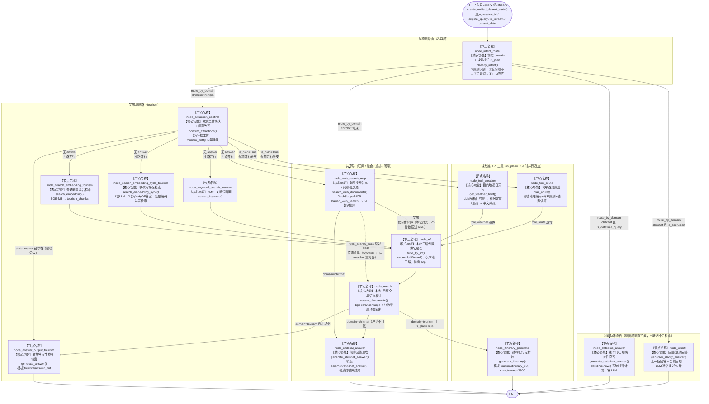

# 检索生成模块深度解析 —— 统一查询图（文旅 / 闲聊路由 + 多路召回 + RRF + 重排 + 生成）

> 本文档**代码驱动**：所有节点名、函数名、集合名、常量与模板名均出自 `app/process/unified_query/`、`../app/rag/common`、`app/rag/tourism_query/`、`../app/api/http/query_server.py`、`app/shared/utils/{sse_utils,task_utils}.py`。
> 编排框架：LangGraph（`StateGraph`），查询链路在统一图 `unified_query_app` 中编排，编译入口见 `../app/process/unified_query/agent/main_graph.py`。
> 状态载体：`UnifiedQueryGraphState`（含 `domain` 路由字段）。

**一句话架构**：一次用户 Query 先进 **`node_intent_route` 意图路由（四层判定 + 规划识别 + 时间/困惑前置拦截）**，把问题分流到文旅 / 闲聊两条链；文旅**本地知识库链**并行跑「普通向量 + 多改写(HyDE) + BM25 关键词（+ 联网搜索）」多路召回，在 **`node_rrf` 做本地三路融合**，再到 **`node_rerank` 汇入网页结果做全局语义精排**，最后按域落到对应**答案输出节点**；**规划类问题**（is_plan=True）在文旅链额外并行追加「天气 + 路线」两个 API 工具节点，最终由 **`node_itinerary_generate` 行程拼装**输出结构化行程；闲聊链**不碰本地库**，仅「联网搜索 + 闲聊生成」；其中**纯时间/日期询问**与**困惑澄清输入（"？"等）**在意图层就被前置拦截，直接走 `node_datetime_answer`（系统时钟直答）或 `node_clarify`（结合上一条回答澄清），**不联网、不检索、不重生成行程**。

---

## 第一部分：流程架构图

### B-1 统一查询图全貌（unified_query_app，15 节点）

> 图中每个节点均以 `【节点名称】` 标注图内注册名、以 `【核心功能】` 标注职责，并用 `核心技术调用` 行注明对应的 service 函数与数据源。边上的分支条件是 `main_graph.py` 中各 `conditional_edges` 路由函数的真实判定。

**读图要点（与代码一一对应）**：

| 分支边 | 路由函数 | 判定来源 |
|---|---|---|
| `node_intent_route` → 文旅 / 闲聊（chitchat 内再细分） | `route_by_domain` | `state["domain"]`，缺省回落 `tourism`；`chitchat` 时按 `is_datetime_query` → `node_datetime_answer`、`is_confusion` → `node_clarify`、否则 → `node_web_search_mcp` |
| `node_attraction_confirm` → 4 路（+ 规划 2 工具） | `after_attraction_confirm` | 文旅**不生成澄清话术**；`is_plan=True` 时追加 `node_tool_weather` + `node_tool_route` |
| `node_web_search_mcp` → 闲聊 / RRF | `after_web_search` | `domain==chitchat` 走闲聊，否则回主链路 |
| `node_rerank` → 答案/行程节点 | `after_rerank` | `domain=tourism 且 is_plan` 走行程拼装；否则按 `domain` 分发答案节点 |

### B-2 三条典型执行路径（按真实调用顺序）

> 括号内为 LangGraph **super-step 并行**的节点集合（同批并发执行，全部完成后才触发下一节点）。

| 路径 | 执行序列 | 实际运行节点数 |
|---|---|---|
| 文旅·常规问题 | `node_intent_route` → `node_attraction_confirm` → **{`node_search_embedding_tourism`, `node_search_embedding_hyde_tourism`, `node_keyword_search_tourism`, `node_web_search_mcp`}** → `node_rrf` → `node_rerank` → `node_answer_output_tourism` | 10 |
| 文旅·规划类问题 | 常规文旅链基础上，并行集合追加 **{`node_tool_weather`, `node_tool_route`}**，`node_rerank` 后改走 `node_itinerary_generate`（行程拼装） | 12 |
| 闲聊（常规） | `node_intent_route` → `node_web_search_mcp` → `node_chitchat_answer` | 3 |
| 闲聊·时间/日期直答 | `node_intent_route` → `node_datetime_answer`（系统时钟计算，不联网） | 2 |
| 闲聊·困惑澄清（"？"等） | `node_intent_route` → `node_clarify`（结合上一条回答澄清，不联网） | 2 |

---

## 第二部分：深度技术解析

> 节点按实际执行顺序组织。检索/融合/重排三层的算法实现均收敛在 `../app/rag/common`，各域只是**数据源集合、过滤字段、归一化结构与 prompt 模板**不同。

---

### 阶段 0：查询网关、执行模型与 SSE 协议

**涉及文件**：`../app/api/http/query_server.py`、`../app/shared/utils/sse_utils.py`、`../app/shared/utils/task_utils.py`

**节点行为**：
1. `POST /query`：`request.is_stream=False` 走 `execute_query` 同步执行；`is_stream=True` 走 `start_stream_query`——先 `create_sse_queue(session_id)` 建队，再经 FastAPI `BackgroundTasks.add_task(run_stream_query_background, ...)` 后台执行，接口立刻返回 `session_id`；
2. `invoke_query` 是两条模式的公共入口：`clear_task` + `clear_cancel`（清上一轮停止标记）→ 状态置 `processing` → `create_unified_default_state(session_id, original_query, is_stream)`（默认 `domain=tourism`，实际由意图路由改写）→ `unified_query_app.invoke(initial_state)` **同步跑完整张图** → 状态置 `completed`；
3. `GET /stream/{session_id}`：`StreamingResponse(media_type="text/event-stream")`，由 `sse_generator` 消费内存队列，客户端断开（`request.is_disconnected` / `CancelledError` / `BrokenPipeError`）即退出并 `remove_sse_queue`；
4. `POST /stop/{session_id}`：置协作式取消标记 `_cancelled_sessions`，LLM 流式循环**逐 chunk 检查** `is_cancelled()`，命中即中断，已生成部分保留并落库。

**会话管理接口（历史对话读写）**：
- `GET /history/{session_id}`：`build_history_response` 按 `ts` 倒序返回近 N 条历史（`HistoryResponse.items`，含 `_id/session_id/role/text/rewritten_query/item_names/image_urls/ts`）；
- `DELETE /history/{session_id}`：`clear_query_history` 清空该会话全部 Mongo 记录（前端「清空」按钮调用，成功后前端另换新会话 ID）；
- `GET /sessions`：`build_session_list` 按会话聚合（Mongo `$group` by session_id + 逐会话查首条提问做标题/最后一条做预览），供「历史会话管理页」展示会话列表；
- `GET /history-page`：返回 `app/web/sessions.html`（查看/删除/继续历史对话的独立页面）。

**核心技术**：FastAPI `BackgroundTasks` + 每会话一个 `queue.Queue` 的 SSE 中转队列；任务状态/节点进度登记收敛在 `task_utils`（`add_running_task` / `add_done_task` 在流式模式下调用 `task_push_queue` 推送 `progress` 事件，载荷为 `status + done_list + running_list`，节点名经 `_NODE_NAME_TO_CN` 转中文展示名）；服务 `lifespan` 内 `asyncio.to_thread(warmup_all, True)` **预热本地模型**（失败仅退化为首次查询懒加载，不阻塞启动）。

**SSE 事件协议**（`SSEEvent`）：`ready`（连接建立）→ `progress`（节点进度）→ `delta`（LLM 逐字增量）→ `final`（完整答案 + `image_urls` + `domain`）；异常时推 `error`。

**设计意图**：
- **图整体放在后台线程同步执行**，SSE 只做“队列→响应流”的搬运，事件循环不被 LLM/GPU 阻塞，`run_in_executor` 进一步避免 `queue.get` 卡死事件循环；
- **进度透出**：每个节点执行前后登记 running/done，前端可实时看到“正在检索哪一路”，对应“豆包式”的打字机与步骤反馈体验；
- **流式与停止是一对协作机制**，不做线程强杀，避免 LLM 流中断在半句脏状态。

---

### 阶段 1：意图路由节点 node_intent_route

**涉及文件**：`../app/process/unified_query/agent/nodes/node_intent_route.py`、`../app/rag/common/intent_route_service.py`

**节点行为**：调 `classify_intent(state)` 得到二分类 `domain` 写回 `state["domain"]`；若为 `chitchat`，额外把 `rewritten_query` 预填为 `original_query`（闲聊链不经过主体改写节点，联网搜索需要 `rewritten_query` 非空）；命中规划类句式时写 `state["is_plan"]=True`，供后续规划分支（API 工具调用）消费。

**核心技术 —— 规划识别（第零层）+ 三层匹配（成本从 0 到高逐级兜底，任意一层命中即短路）**：

| 层 | 函数 | 机制 | 关键参数 / 判定 |
|---|---|---|---|
| ⓪ 规划识别 | `_PLAN_QUERY_PATTERN` 正则 | 在意图判定**之前**先扫规划句式（`规划|帮我安排|安排一下|行程安排|路线安排|旅游计划|几日游|\d+天\d*晚|怎么玩|值得去吗`），命中即 `state["is_plan"]=True` | **只标记不改域**；放在最前，追问短句"那帮我规划一下"也能覆盖；后续 `after_attraction_confirm`/`after_rerank` 据 `is_plan` 追加工具分支与行程拼装 |
| ① 追问继承 | `inherit_domain_if_followup` | `len(query)<=20` 且命中追问句式正则 `^(那|它|他|她|这个|那个|这些|那些|还有|再|另外|其他|此外|那么|其次|然后)…|呢[?？]?$` → 读近 3 条历史（`history_repository.list_recent`） | 只继承 `tourism`，**不继承 chitchat**（闲聊后用户多半转入正题，继承闲聊反而挡掉检索） |
| ② 关键词规则 | `match_by_rule` | 白名单/关键词子串命中，优先级 **闲聊白名单 > 文旅词 > 知识型句式兜底** | 文旅同时命中时文旅优先（更具体）；知识句式正则 `什么是|是什么|为什么|怎么|如何…` 兜底归 `tourism`（**检索优先策略**，见下） |
| ③ LLM 兜底 | `classify_by_llm` | prompt `tourism/intent_route`（注入 `history_text`），`glm-4-flash` JSON 模式，`cached_invoke(namespace="intent_route")` | 同 (query,history) 命中缓存零延迟；LLM 判闲聊但命中知识句式则**推翻为 tourism**；返回非法域默认 `tourism`；异常默认 `tourism` |

**设计意图**：
- **成本阶梯**：追问继承零 LLM 往返，关键词规则零成本覆盖大部分场景，LLM 只兜剩余少数——“每省一次 0.8~1.5s 的模型往返就是一次响应提速”；
- **检索优先策略**：代码注释记载了真实误判史——“什么是猫娘”曾被 LLM 归为闲聊（联网搜索，本地库完全不参与）。知识型句式宁可错检索也不走闲聊，同时把纯疑问词句式单独成类，避免“这里怎么样”这类带疑问词的句子被“怎么样”误抢；

---

### 阶段 2：主体确认节点（文旅 node_attraction_confirm）

**一次 LLM 调用同时完成「问题改写 + 主体抽取」→ 向量检索到主体库按阈值确认 → 写回 `state`**；未确认主体时降级为全库检索。

#### 2.1 文旅 node_attraction_confirm —— `../app/rag/tourism_query/attraction_confirm_service.py`

**节点行为**（`confirm_attractions`）：`validate_query_identity` → `load_history(limit=10)` → 一次 LLM JSON 调用（prompt `tourism/rewritten_query_and_attractions`，`cached_invoke(namespace="tourism_query_rewrite")`）产出 `rewritten_query + attractions`（主体=景点名/文化主题）→ 有主体则 `search_entity_candidates` 对 `tourism_entity` 集合混合检索（`(0.5,0.5)`）→ `select_confirmed_entities` 只收 `>= ENTITY_CONFIRM_THRESHOLD(0.65)` 的 Top1 → `apply_attraction_result` 写回 `item_names + rewritten_query` → `save_user_message`。

**降级策略**：文旅**不生成澄清话术**——未确认主体时 `item_names=[]`，直接**降级全库检索**。设计意图在模块注释中写明：要支撑“北欧文化有什么特点”这类**无景点归属的纯文化问题**，追问澄清反而把正确路径堵死；主体过滤是可选项而非必选项。

---

### 阶段 3：多路并行召回（LangGraph super-step）

确认节点之后的检索节点**同时变为可执行态**，LangGraph 将其作为一个 super-step 并发调度，RRF 边是隐式同步屏障。四路各有分工，覆盖“语义近似 / 假设扩展 / 字面精确 / 时效外延”四种互补的召回信号。

#### 3.1 普通向量检索 node_search_embedding_*（主路）

**涉及文件**：`app/rag/tourism_query/search_embedding_service.py`

**节点行为**：取 `rewritten_query`（缺省用 `original_query`）→ `llm_provider.embed_documents([query])` 得到 BGE-M3 的 `{"dense": [...], "sparse": {...}}` 双向量 → `milvus_gateway.create_requests` 构造混合检索请求 → 有主体名则拼过滤表达式 `item_name in {names}`（`build_entity_expr`）→ 对 `tourism_chunks` 执行 `hybrid_search`。

**核心技术**：BGE-M3（配置 `BGE_M3`）**稠密 1024 维 + 学习型稀疏（SPLADE 风格）双路一次编码**；Milvus 混合检索 `ranker_weights=(0.9,0.1)`（稠密为主、稀疏为辅）、`norm_score=True`（分数归一化到可比区间）、`limit=RETRIEVAL_DEFAULT_LIMIT(5)`；结果经 `normalize_retrieved_chunk` 统一为查询链内部文档结构（`chunk_id / title / parent_title / part / file_title / content / score / type="milvus" / url=None`）。文旅归一化额外携带 `item_name/content_type/region/cultural_theme/category/source_type/extra_meta`（第5点起 extra_meta 全链路透传），供答案生成做来源/属性标注与专属字段引用。

**设计意图**：主体确认的收益在此兑现——**有主体限定即定向检索（过滤表达式下推 Milvus），无主体（推荐类/开放文化类问题）自动全库检索**；`(0.9,0.1)` 权重说明系统认为语义稠密是中文问答的主信号，稀疏仅作词面补偿。

#### 3.2 多改写增强检索 node_search_embedding_hyde_*（原 HyDE 升级）

**涉及文件**：`../app/rag/common/multi_query_service.py` + `app/rag/tourism_query/search_embedding_hyde_service.py`

**节点行为**（`search_embedding_hyde` → `search_chunks_with_multi_query`）：
1. **跳过条件**：`len(rewritten_query) < 15` 或已确认主体 → 返回 `[]`（短查询直接编码检索已够；主体已确认时范围本就精确，假设扩展反而引噪 + 浪费约 2s）；
2. `generate_query_variants`：**一次 LLM JSON 调用**（prompt `tourism/multi_query`）同时产出「≤2 条视角改写（`MULTI_QUERY_MAX_REWRITES=2`，逐条 `clean_rewrite_text` 去序号/引号/压空白/截 100 字）+ 1 段 HyDE 假设答案（截 300 字）」；
3. `build_multi_queries`：改写原样入列，假设答案按经典 HyDE 拼法 `f"{rewritten_query},{hyde_answer}"` 入列；去重且剔除与 `rewritten_query` 全同的项；
4. `retrieve_multi_queries`：把 2~3 条查询**合并成一次批量 `embed_documents`**（规避 BGE-M3 非线程安全、encode 被全局锁串行化导致的耗时随路数线性叠加）→ `ThreadPoolExecutor(max_workers=min(4, 路数))` 并发调 `search_*_chunks_by_vector` 逐路检索（各 `limit=5`）→ **按 `chunk_id` 去重合并**（先返回的分数最高路优先保留）。

**设计意图**：这是对旧 HyDE 单路的“**一次 LLM 调用、召回视角从 1 扩到 3**”的升级——墙钟时间几乎不增加，却让查询从“猜一个假设答案”变成“三个角度同时找”；`(query, hyde_answer)` 的拼接让向量靠近“答案所在区域”，是 HyDE 论文的核心直觉在本项目里的保留。

#### 3.3 BM25 关键词检索 node_keyword_search_*（字面精确路）

**涉及文件**：`../app/rag/common/bm25_service.py` + `app/rag/tourism_query/search_keyword_service.py`

**节点行为**（`search_by_bm25` → `get_bm25_index` → `BM25Index.search`）：取改写后查询 → 进程内索引 `jieba` 分词（去停用词/单字/纯标点）→ `BM25Okapi.get_scores` → `score > BM25_MIN_SCORE(0)` 且（有主体时）`item_name in allowed` 过滤 → Top `BM25_TOP_N(5)` 命中包装成 Milvus 风格结构复用 `normalize_retrieved_chunk`。

**进程内索引的关键机制**：
- **数据来源**：索引数据用 Milvus **标量 `query` 分页拉取**（`BM25_QUERY_PAGE_SIZE=1000`，只取标量字段不加载向量，代价极低），包装成 `{"id", "distance", "entity"}` 与 `hybrid_search` 对齐，下游归一化函数零改动复用；
- **缓存与刷新**：按 `collection_name` 缓存在 `_index_cache`，TTL `BM25_INDEX_TTL_SECONDS=600` 自动过期重建（感知新导入）；导入完成后可 `invalidate_bm25_cache(collection)` **显式失效**；
- **内存保护**：`BM25_MAX_DOCS=50000` 上限，超规模自动降级（跳过关键词路只走向量），注释明确未来应切 Milvus 原生全文检索；
- **健壮性**：任何异常/索引不可用/总开关 `BM25_ENABLE=False` 都返回 `[]`，关键词路是“增强项”，绝不影响向量主链路。

**设计意图**：BGE-M3 的稀疏向量是“学习型稀疏”，语义泛化强但**专有名词的字面命中反而弱于经典 BM25**——景点名、人名、章节名、门票政策术语这类查询正是 BM25 的 IDF 加权强项；两路互补，交由 RRF 平等投票。

#### 3.4 联网搜索 node_web_search_mcp（时效外延路）

**涉及文件**：`../app/process/unified_query/agent/nodes/node_web_search_mcp.py`、`../app/rag/common/web_search_service.py`

**节点行为**（`search_web_documents`）：校验 `rewritten_query` → 经 DashScope 百炼 MCP 调 `bailian_web_search`（`count=10`）→ `asyncio.run(asyncio.wait_for(..., timeout=WEB_SEARCH_TIMEOUT(2.5)))` → 解析 `pages` 列表；超时/异常**降级为空列表**（写 `{"web_search_docs": []}`），**绝不阻断本地库主链路**。

**核心技术 —— 协议级绕坑**：OpenAI Agents SDK 的流式 HTTP MCP 在 `mcp>=2` 时默认发 `server/discover` 握手（MCP v2 新协议），而 DashScope 服务端不支持会返回 HTTP 500；代码改用 `mcp.Client(transport, mode="legacy")` + `streamable_http_client` **显式走传统 `initialize` 握手**，认证头 `Authorization: Bearer <key>` 经 `httpx2.AsyncClient` 注入。

**设计意图**：代码注释给出清晰定位——“联网是锦上添花的补充路，本地知识库才是主链路”。2.5s 熔断阈值 + 空降级保证最坏情况下查询仍在本地闭环内完成；它对两类场景价值最大：**文旅四路并行中的时效/知识盲区**；对闲聊链则是唯一信息源。

---

### 阶段 4：RRF 融合节点 node_rrf（本地三路同步屏障）

**涉及文件**：`../app/rag/common/rrf_service.py`、`../app/process/unified_query/agent/nodes/node_rrf.py`

**节点行为**（`fuse_by_rrf` → `reciprocal_rank_fusion`）：
1. `validate_rrf_inputs`：取 `embedding_chunks / hyde_embedding_chunks / keyword_chunks`，**允许某一两路为空，三路全空才抛错**（多改写/关键词有跳过条件）；
2. 三路以权重 `1.0` 组成 `param_list` 进入核心算法；
3. 每个 `chunk_id` 累加 `score += 1/(RRF_K(60) + rank) × weight`（rank 从 1 计），保留首次出现的原始文档实体；
4. 按总分降序取 `RRF_TOP(5)` 写回 `state["rrf_chunks"]`。

**图上为什么 6 条检索边都指向它**：RRF 在算法上只融合本地三路，但**图结构上让 `node_web_search_mcp` 也先落到它再进重排**——等于把 RRF 当成“全路检索完成的同步屏障”，保证 `node_rerank` 执行时 `web_search_docs` 一定已就绪（结合 3.4 的超时空降级，永远不会因联网拖慢融合）。

**设计意图**：RRF **只看排名不看原始分数**，规避了三路分数口径不可比的问题（BGE 稠密 cosine、学习型稀疏、BM25 的 IDF 分数完全不在一个量纲）；权重相等即“一路一票”的公平融合。**网页结果刻意不参与 RRF**——网页 snippet 与本地 chunk 粒度/语义域不同，硬融合反而稀释本地信号，真正的跨来源统一排序留给下一阶段的重排模型。

---

### 阶段 5：全局重排节点 node_rerank（跨来源统一精排）

**涉及文件**：`../app/rag/common/rerank_service.py`、`../app/process/unified_query/agent/nodes/node_rerank.py`

**节点行为**（`rerank_documents`）：
1. `validate_rerank_inputs`：`rrf_chunks / web_search_docs` 至少一路非空；
2. **规划类去 web 路（2026-09-04 新增）**：`is_plan=True` 且本地 KB 候选非空时剔除全部网页候选，仅保留 KB 参与精排——实测规划问句会带出大量网页片段并把 KB chunk 挤出 top5，行程拼装只看到网页摘要导致日期/交通数值幻觉；KB 为空时保留网页兜底；
3. `merge_rrf_and_web`：统一为 `{title, text, url, type, score}`——本地取 `content` 字段、`type="milvus"`、`url=None`；网页取 `snippet`、`type="web"`、保留 `url`、score 置 0；额外透传来源与业务字段供答案生成使用：`file_title`（来源文件名）、`content_type/extra_meta`（网页块对应置 None）；
4. `score_and_sort_chunks`：取 `rewritten_query or original_query` 为问题 → `llm_provider.reranker_model()`（bge-reranker-large，配置 `BGE_RERANKER_LARGE`）→ `compute_score(pairs, normalize=True)` → `round(score, 4)` 写回并按分降序；
5. `dynamic_topk`：**按分数断崖动态截断**而非固定取 N。

**核心技术 —— 超长候选的零 LLM 压缩（性能关键）**：
- 重排模型输入上限 `RERANK_MAX_INPUT_TOKENS=512`，超长候选必须压缩。历史实现是逐条**串行 LLM 生成式精简**——一次查询最多 9 次 LLM 调用、累计 30~48s，是全链路最大瓶颈；
- 现改为**按来源分治的零 LLM 压缩**（毫秒级）：先用 tokenizer 对问题编码，反推单条字符上限 `limit = max(50, int((512 - len(query_tokens) - 4) / 1.3), 20)`（`1.3` 为中文 token≈字符换算比，`-4` 为拼接特殊 token）；再用字符数**粗筛**超长候选（短候选免 token 编码）；
  - `type=web`：**硬截断**（`truncate_text_for_rerank`）——snippet 本就是摘要，截断损失可忽略；
  - `type=milvus`：**句子级抽取式压缩**（`condense_text_for_rerank`）——按句末标点切句 → jieba 取词（停用词过滤）→ 每句打分 `覆盖率(coverage)×2.0 + 密度(density) + 位置奖励(前3句 +0.15)` → 取分高句**按原文顺序还原**拼接，保证被 tokenizer 截断时留下的是与问题最相关的内容；
- 仅当 `RERANK_LLM_REFINE_ENABLE=1` 才回退 LLM 精简，且强制 `ThreadPoolExecutor(RERANK_REFINE_WORKERS=6)` 并行，避免重演串行累加。

**核心技术 —— 分数断崖动态截断**（`dynamic_topk`）：`min_topk=1`（至少保 1 条），`max_topk=min(10, 候选数)`；从第 `min_topk-1` 项起扫描相邻分差，若 `绝对差 > RERANK_GAP_ABS(2)` 或 `相对差 > RERANK_GAP_RATIO(2)` 即判定"分数断崖"在此截断。目的：**文档相关性存在天然分组，跨组硬取 TopN 会把低相关噪声塞进上下文**，断崖截断让送入 LLM 的始终是"质量连续的一段"。
> 口径备注（2026-09-04）：`compute_score(normalize=True)` 输出 0~1 的 sigmoid 分数，相邻分差恒 <2，两个断崖阈值实际永不触发——`dynamic_topk` 等价于取 `min(10, N)` 条；网页候选挤出的真正防线是下面的 **KB 保底席位**。

**核心技术 —— KB 保底席位**（`enforce_kb_quota`，2026-09-04 P1 新增）：答案生成只取 `reranked_docs[:5]`，实测(tr-002)网页候选会把本地 KB chunk 全部挤出前 5（RRF 里的《成都美食推荐》精排后被网页刷掉，答案丢金标出处）。本步骤在精排输出**前 5 窗口**（`RERANK_KB_QUOTA_WINDOW=5`，与答案切片对齐）内为本地候选保底 `RERANK_MIN_KB_TOPK=3` 个席位：不足时用窗口外得分最高的 KB 候选，从低到高置换窗口内网页席位。纯本地（规划类去 web 后）/纯网页（本地路为空）场景无感透传。

**设计意图**：RRF 分数在本地与网页间不可比，**重排模型（bge-reranker-large）是系统内第一次也是唯一一次真正把两类来源放进同一评分体系做全局排序**；压缩策略把“历史最大时延源”从 30~48s 打到毫秒级，是响应提速的核心工程之一。

---

### 阶段 6：答案输出与闲聊节点（node_answer_output_* / node_chitchat_answer）

#### 6.1 答案输出 node_answer_output_tourism

**涉及文件**：`app/rag/tourism_query/answer_output_service.py`

**节点行为**（`generate_answer`）：
1. `try_return_existing_answer`：若 state 已带 `answer`（典型是主体澄清话术），不调模型——流式逐字 `DELTA`（每字 `sleep(0.1)` 模拟打字机）或非流式直接写任务结果后返回；
2. `validate_generation_inputs`：`reranked_docs` 为空时注入占位块 `{"title":"无","score":0,"type":"milvus","text":"未找到相关资料"}`，让模型生成“未找到资料”兜底回答而非报错；
3. `build_answer_prompt`：**只取重排前 5 块**（重排已排序，靠后块相关性低）→ 每块截 800 字 → 逐块标注 `第N块: 标题/匹配度得分/来源(网络搜索|向量查询)/内容` → 拼 `history_text`（复用 `build_history_text`）→ 标注“本次关联主体”或“未确认主体，依据检索内容作答”→ 渲染模板 `tourism/answer_out`。文旅块额外：标题行拼 `类型:{content_type}`，有专属字段时在内容后追加 `\n专属字段:{JSON}`（星级/价格/招牌菜等结构化信息供 LLM 精确引用）；
4. `final_answer`：`llm_provider.chat().bind(max_tokens=1500)`（限长防拖慢）；流式模式逐 chunk 收增量，**per-delta 剥离引用标记** `【第N块】/【N】`（用户流式时也看不到），逐字 `push_to_session(DELTA)`，且每个 chunk 前查 `is_cancelled`（用户点停止即中断，已生成部分保留）；非流式一次性 `invoke`；统一 `normalize_answer_text`（压空行、清孤立图片行）后 `set_task_result` + 写回 `state["answer"]`；**代码级出处标注在 normalize 之后追加**——`build_source_section` 拼 **"参考资料"分节**：知识库块列文件名（`（知识库）`，有 `source_path` 时附 `（路径：…）`）、网页块列标题 markdown 链接或裸 URL（`（网页）`），按精排前 5 去重，不依赖 LLM 生成；
5. `extract_image_urls`：从参考文档提取配图——`url` 直链命中图片后缀（png/jpg/gif/jpeg/svg）与正文内 markdown 图片 ``，去重写入 `state["image_urls"]`；
6. `save_assistant_message`：role=assistant 落 Mongo，带 `rewritten_query`、关联主体（底层字段 `item_names`）、`image_urls`、`domain`。

**设计意图**：**“先剪后答”**——上下文裁剪（Top5 × 800 字）、限长（1500 token）、每块来源/得分标注三道闸共同压低 LLM 输入规模与幻觉风险；传入的是 `item_names`（景点/文化主题） 模板把“主体意识”写进生成约束；引用标记在 **delta 级**剥离保证流式与最终稿一致。

#### 6.2 闲聊回答 node_chitchat_answer

**涉及文件**：`../app/process/unified_query/agent/nodes/node_chitchat_answer.py`、`../app/rag/common/chitchat_answer_service.py`

**节点行为**（`generate_chitchat_answer`）：问题取 `original_query or rewritten_query` → 取 `web_search_docs` **前 `CHITCHAT_WEB_TOP(5)` 条**拼上下文（空则占位“（无相关联网信息）”）→ 渲染模板 `common/chitchat_answer` → `final_answer`（同 6.1 的流式/停止/清理逻辑，`max_tokens=1500`）→ 落历史（role=assistant）。

**设计意图**：闲聊是“轻量兜底”，**不访问本地知识库**——寒暄/自我介绍/致谢类问题不值得走昂贵检索；注意其落库**不带 `domain`**，与阶段 1 的“只继承 tourism”形成闭环：闲聊之后用户转入正题时，追问继承不会把上轮闲聊域带下来挡掉检索。

---

### 阶段 6.5：规划类 API 工具与行程拼装（node_tool_weather / node_tool_route / node_itinerary_generate）

> 规划类问题（"我明天想去九寨沟，帮我规划一下"）是「时间感知 + 实时数据 + 结构化输出」三重叠加的增强链路。普通答案节点答不了实时天气/路况/花销，因此为 `is_plan=True` 的文旅问题单独接了三个节点：两个 API 工具节点在检索路并行执行、一个行程拼装节点在 rerank 后替代普通答案输出。

#### 6.5.1 天气工具 node_tool_weather —— `app/rag/tourism_query/weather_tool_service.py`

**节点行为**（`get_weather_brief`）：
1. `extract_destination_info`：**以 `original_query` 为准**（含出发地/目的地最完整），`rewritten_query` 仅作指代消解参考——`cached_invoke(namespace="plan_weather_extract", cache_parts=(original, rewritten))` 调 LLM（prompt `tourism/plan_extract`）一次产出 `{origin, destination, city, latitude, longitude}`；天气与路线两工具**共用这一次调用与缓存**；
2. `resolve_location` 两级定位：
   - 和风 GeoAPI 城市搜索（`qweather_city_lookup`，`GET /geo/v2/city/lookup`，`X-QW-Api-Key` 头认证），先目的地原名、再所属城市/州；
   - 未命中时用 LLM 粗略经纬度兜底（`_CHINA_LAT_RANGE=(15,55)`/`_CHINA_LON_RANGE=(70,140)` 校验中国范围，防幻觉坐标）；
3. `fetch_daily_forecast`：和风逐日预报（`/v7/weather/{3|7|15|30}d`，按 `TOOL_WEATHER_DAYS` 自动取最近档），支持直接传 `"经度,纬度"` 坐标；取白天天气 `textDay`、最高/最低温、降水量 `precip`；
4. `format_weather_text`：组装中文简报（目的地 + 逐日 `日期:天气,最低~最高°C[,降水量xmm]`），写入 `state["tool_weather"]={"ok":True,"destination","text"}`。

**降级策略**：未配 `QWEATHER_API_KEY/HOST`、未解析到目的地、定位失败、请求超时均返回 `ok=False` 空简报——天气是**增强信息**，缺了只影响规划类回答的天气部分，绝不阻断主链路。

**关键技术点**：
- 和风逐日预报**无降水概率字段**（Open-Meteo 有），简报改用「降水量 mm」表示；`textDay` 已是中文（小雨/多云等）；
- 和风 GeoAPI 需要控制台单独开通权限，未开通返回 403 时自动落到 LLM 坐标兜底；**2026-09-09 实测该 GeoAPI 已恢复可用（code=200）**，此前"只能靠 LLM 坐标兜底"的结论已过时。
- **2026-09-09 起**：上表和风实现细节已迁入 `app/infra/weather_gateway.py`，本模块改为调用网关（主和风 / 备高德自动降级、输出归一化），详见 `docs/项目执行计划_20260909.md` 1.5 节。

#### 6.5.2 路线工具 node_tool_route —— `app/rag/tourism_query/route_tool_service.py`

**节点行为**（`plan_route`）：
1. 复用 `extract_destination_info`（与天气同一次 LLM 调用+缓存）取出发地 `origin` 与目的地 `destination`；
2. `amap_geocode`（高德 `GET /v3/geocode/geo`）把出发地/目的地转经纬度；目的地编码未命中时用 LLM 坐标兜底（中国范围校验），出发地无兜底（编码失败即放弃，避免报错路线）；
3. `fetch_driving_route`（高德 `GET /v3/direction/driving`，`extensions=base`）取首选路径 `{distance_km, duration_seconds}`；
4. `format_route_text` 组装简报，并**在代码层确定性计算油费**：`distance_km / 100 × PLAN_FUEL_CONSUMPTION × PLAN_FUEL_PRICE`（参数在 .env，默认 8L/百公里、7.8 元/L）——**不经 LLM，防编造**；
5. 写入 `state["tool_route"]={"ok":True,"origin","destination","text"}`。

**降级策略**：未配 `AMAP_API_KEY`、未提及出发地、编码/规划失败均返回 `ok=False`，不阻断主链路。

#### 6.5.3 行程拼装 node_itinerary_generate —— `app/rag/tourism_query/itinerary_service.py`

**节点行为**（`generate_itinerary`）：
1. `build_itinerary_prompt`：取 rerank 前 5 块 KB 上下文 + `tool_weather`/`tool_route` 简报（含代码层油费）+ `current_date` + 历史，渲染专用模板 `tourism/itinerary_out`；其中【用户问题】**优先取 `original_query`**（保留"可以吗/行不行"征询语气，改写句已被归一化成无语气陈述）；命中征询句式（`CONSULT_PATTERN`，如"我想坐飞机去杭州可以吗"）时额外注入 `consult_instruction`，要求**先输出可行性结论段，再输出完整行程**；
2. `llm_provider.chat().bind(max_tokens=ITINERARY_MAX_TOKENS=2500)`（比普通答案 1500 放宽，容纳更长行程）；
3. 流式/普通双模式，输出结构化行程：**行程概览 → 每日安排 → 花销预估 → 装备注意**；复用与普通答案相同的 SSE 协议（delta + task_result）+ 引用标记剥离 + `extract_image_urls` + 历史落库；流式 delta 经 `BlankLineCompressor` 逐段压缩连续空行（模型常输出 `\n\n\n\n` 大片空行），再代码级 `_compact_itinerary` 紧凑化排版；
4. 失败时兜底答复保证 SSE 正常收尾。

**图上的接线**（`main_graph.py`）：
- `after_attraction_confirm`：`is_plan=True` 时并行集合追加 `node_tool_weather` + `node_tool_route`；
- 两工具节点 `add_edge(→ node_rrf)`，与检索路在 RRF 屏障汇聚（RRF 只产 `rrf_chunks`，`tool_*` 原样透传）；
- `after_rerank`：`domain=tourism 且 is_plan` 分流到 `node_itinerary_generate`（不再走普通答案输出）。

**设计意图**：
- **时间感知靠注入而非模型记忆**：`current_date`（"2026-09-03 周四"）在创建状态时注入，模板规则要求把"明天/周末"等相对时间换算成具体日期；
- **实时数据走专用 API 工具而非联网兜底**：联网搜索给的是碎片化网页，天气/路线有结构化官方 API，能拿到确定性数据（温度/距离/时长），且油费这类派生数值在**代码层算好再喂 LLM**，从根上杜绝幻觉；
- **降级不阻断**：所有工具都是"缺了也能答"的增强项，任何失败返回 `ok=False`，主检索链路照常闭环；
- **与普通答案输出解耦**：行程是结构化长文本，单独模板 + 单独节点 + 放宽 max_tokens，避免污染普通问答的简洁回答。

---

### 阶段 7：关键常量与配置速查

| 模块 | 常量 / 配置 | 值 | 作用 |
|---|---|---|---|
| 主体确认 | `ENTITY_CONFIRM_THRESHOLD` | 0.65 | 相似度 ≥0.65 才确认主体 |
| 主体检索 | 主体库混合检索权重 | (0.5, 0.5) | 景点名/文化主题确认检索，稠密稀疏对半 |
| 向量主路 | `RETRIEVAL_DEFAULT_LIMIT` / 检索权重 | 5 / (0.9, 0.1) | 每路取 5 条；稠密为主、稀疏为辅 |
| 多改写 | `MULTI_QUERY_ENABLE` / `MULTI_QUERY_MAX_REWRITES` / `WORKERS` | True / 2 / 4 | 总开关、改写上限、并发检索线程 |
| 多改写 | 跳过条件 | 查询 <15 字 或 已确认主体 | 短查询/精确范围免扩展 |
| BM25 | `BM25_ENABLE` / `TOP_N` / `TTL` / `MAX_DOCS` | True / 5 / 600s / 50000 | 关键词路开关、TopN、索引缓存刷新、内存保护 |
| 联网 | `WEB_SEARCH_TIMEOUT` | 2.5s | 超时熔断阈值，超时降级空结果 |
| RRF | `RRF_K` / `RRF_TOP` / 三路权重 | 60 / 5 / 1.0 | 平滑系数、输出条数、公平投票 |
| 重排 | `RERANK_MAX_INPUT_TOKENS` / `CHAR_RATIO` / `MIN_SUMMARY_CHARS` | 512 / 1.3 / 50 | 超长压缩的 token 上限与换算 |
| 重排 | `RERANK_MAX_TOPK` / `MIN_TOPK` / `GAP_ABS` / `GAP_RATIO` | 10 / 1 / 2 / 2 | 断崖动态截断参数 |
| 重排 | `RERANK_LLM_REFINE_ENABLE` / `REFINE_WORKERS` | False / 6 | LLM 生成式精简开关（默认关）+ 并行度 |
| 答案生成 | Top 块数 / 单块截断 / `max_tokens` | 5 / 800 字 / 1500 | 上下文裁剪与限长 |
| 规划工具 | `TOOL_WEATHER_ENABLE/DAYS/TIMEOUT` | True / 5 / 6s | 天气工具开关、预报天数、请求超时 |
| 规划工具 | `QWEATHER_API_KEY/HOST` | .env 配置 | 和风天气 Key + 专属 API Host（未配则工具停用） |
| 规划工具 | `AMAP_API_KEY/TIMEOUT` | .env 配置 / 6s | 高德路线 Key + 超时 |
| 规划工具 | `PLAN_FUEL_CONSUMPTION/PRICE` | 8L / 7.8 元 | 油费估算参数（代码层确定性计算） |
| 行程拼装 | `ITINERARY_MAX_TOKENS` | 2500 | 行程长文本放宽的生成上限 |
| 环境开关 | `BM25_ENABLE` `MULTI_QUERY_ENABLE` `RERANK_LLM_REFINE_ENABLE` | 全默认开启（后者默认关） | 三路召回/精排模式可灰度开关 |

### 阶段 8：为“接近豆包/千问首字速度”做的检索链路提速设计对照

> 检索生成模块的工程目标之一是响应提速。以下措施均来自代码，按“省时手段 → 落地位置 → 效果量级”梳理，便于面试讲解时引用。

| 提速手段 | 落地位置 | 效果 |
|---|---|---|
| 本地模型启动预热 | `query_server.lifespan` → `warmup_all` | 消除 BGE-M3 / 重排模型首次查询冷启动（可到秒级） |
| 进程内 LLM 缓存 | `llm_cache.cached_invoke`（intent/rewrite 两处） | 相同 (query, history) 命中即 0 LLM 往返（省 0.8~1.5s） |
| 一次 LLM 多产出 | `multi_query_service`（改写+HyDE 合一） | 召回视角 ×3，LLM 调用次数不变 |
| 批量编码 + 并发检索 | `retrieve_multi_queries` | 规避 BGE-M3 串行锁，多路召回墙钟≈单路 |
| LangGraph super-step | 检索层 3~4 节点并行 | 并行路不叠加时延，取最慢一路 |
| 短查询/已确认主体跳过扩展 | `search_embedding_hyde` 跳过条件 | 明显不需要扩展时省 ~2s |
| 零 LLM 抽取式压缩 | `rerank_service.condense_text_for_rerank` | 把重排前 30~48s 串行精简打到毫秒级（本模块最大单项优化） |
| 联网 2.5s 超时熔断 | `web_search_service` | 补充路超时即降级，主链路不背时延 |
| 分数断崖动态截断 | `rerank_service.dynamic_topk` | 候选数自适（1~10），少给 LLM 喂噪声、省 token |
| 上下文裁剪 + 限长 | `build_answer_prompt`（Top5×800）+ `bind(max_tokens=1500)` | 控制生成前输入与生成长度，流式首字更快 |

### 阶段 9：代码索引（快速定位）

| 关注点 | 文件 |
|---|---|
| 统一图编排 / 全部条件分支 | `../app/process/unified_query/agent/main_graph.py` |
| 查询状态定义 | `../app/process/unified_query/agent/state.py` |
| HTTP 网关 / SSE / 停止 / 历史 | `../app/api/http/query_server.py` |
| 意图路由（三层） | `../app/rag/common/intent_route_service.py` |
| 主体确认 | `../app/rag/tourism_query/attraction_confirm_service.py` |
| 普通向量 / 多改写 / BM25 / 联网 | `app/rag/tourism_query/search_embedding_service.py`、`search_embedding_hyde_service.py`、`search_keyword_service.py`、`../app/rag/common/multi_query_service.py`、`bm25_service.py`、`web_search_service.py` |
| RRF / 重排 | `../app/rag/common/rrf_service.py`、`rerank_service.py` |
| 答案输出 / 闲聊 | `app/rag/tourism_query/answer_output_service.py`、`../app/rag/common/chitchat_answer_service.py` |
| 规划工具 / 行程拼装 | `app/rag/tourism_query/weather_tool_service.py`、`route_tool_service.py`、`itinerary_service.py` + 节点 `node_tool_weather.py`、`node_tool_route.py`、`node_itinerary_generate.py` |
| 会话管理接口 | `../app/api/http/query_server.py`（`/sessions`、`/history-page`）+ `app/shared/clients/mongo_history_utils.py`（`list_sessions`） |
| prompt 模板 | `app/resources/prompts/tourism|common`（`answer_out / itinerary_out / plan_extract / rewritten_query_and_* / multi_query / intent_route / chitchat_answer / rerank_text_refine`） |

> 代码可读性备注：两处**函数内动态 import**（`history_repository`、`milvus_gateway`）节点文件中存在本地测试残留的旧字段注释，属历史演进痕迹，不影响运行；阅读时以本文件“阶段”为准即可。
