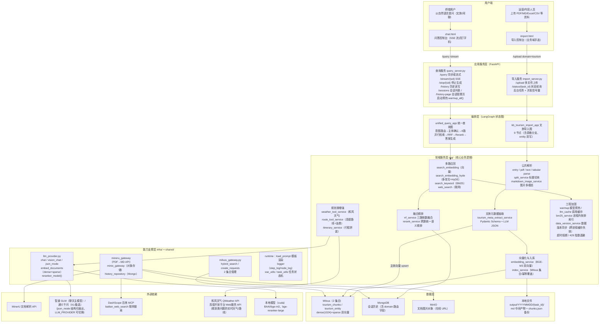

# 文旅单域知识库问答系统 —— 全局项目架构

> 本文档基于项目真实代码逐文件核对产出。凡引用的类名、函数名、集合名、Prompt 模板名均可在代码中直接检索到。

---

## 1. 项目一句话定位

本项目是一套**基于 LangGraph + Milvus + BGE 系列模型**的企业级文旅单域 RAG 问答系统：

- **文旅域**：管理"景点 / 文化知识 / 游记攻略 / 运营表格"知识，支持按主体（景点名、文化主题）过滤与全库检索；
- **通用域**：闲聊（联网回答）与统一意图路由。

系统对外提供**两套独立的 FastAPI 服务**（导入服务、查询服务），内部由**两个 LangGraph 状态图**驱动（文旅导入、统一查询），由**统一查询图**承担「文旅 / 闲聊」分类路由，并识别行程规划（is_plan）意图。

---

## 2. 全局架构图

---

## 3. 核心能力拆解

| 能力 | 实现位置 | 关键点 |
|---|---|---|
| 文件导入 | `import_server.py` + 文旅导入图 | 按上传文件后缀自动走 md/pdf/文本/表格 四类解析管线；表格仅文旅域支持；docx/html 内嵌图片与 PDF 同链路做 VLM 摘要增强 |
| 意图自动路由 | `intent_route_service.py` | 规划识别 + 三层判定：追问继承 → 指代不明拦截（第 2.5 层，确定性澄清反问）→ 关键词规则 → LLM 兜底（带缓存） |
| 多路并行召回 | 统一查询图检索层 | 向量 + 多改写(HyDE) + BM25 关键词 + 联网，LangGraph 超步内并行执行 |
| 融合粗排 | `rrf_service.py` | 本地三路按倒数排名融合（1/(k+rank)），网络结果不参与（评分体系不同） |
| 跨源精排 | `rerank_service.py` | BGE-Reranker 统一打分 + 动态断崖截断；超长候选零 LLM 压缩 |
| 流式问答 | `sse_utils.py` + LLM stream | ready/progress/delta/final/error 五类事件，支持用户主动停止 |
| 规划类增强 | `weather/route/itinerary_service` | 和风天气 + 高德路线（代码层油费估算）+ 结构化行程拼装，失败降级不阻断 |
| 记忆与追问 | MongoDB 历史 + `domain` 字段 | 短追问继承上一轮域；会话列表/删除/继续（`/sessions`、`/history-page`） |
| 缓存与数据版本同步 | `shared/runtime/data_version_service.py` | 导入成功 → 本进程清理 + Mongo `app_meta` 集合版本号广播；查询入口 5s 节流比对，版本变化才刷新 BM25/LLM 两级缓存（跨进程缓存失效，静默降级不阻断主链路） |

---

## 4. 业务闭环描述

**知识注入闭环（导入侧）**：运营人员上传资料 → 按格式解析为 Markdown → 图片经 VLM 摘要后转存 MinIO → 按标题语义切块（超长拆分/过短合并）→ LLM 抽取「主体 + 业务元数据」（景点/内容类型/地区/文化主题）→ BGE-M3 生成稠密+稀疏双向量 → 切块写入 `tourism_chunks` 集合、主体写入 `tourism_entity` 主体索引集合（幂等覆盖），全程节点状态可经 `/status/{task_id}` 实时查询。

**问答服务闭环（查询侧）**：用户提问 → 意图路由定位业务域 + 规划识别 → 主体确认（LLM 改写 + 主体库向量确认）→ 四路检索并行召回（规划类问题额外并行「和风天气 + 高德路线」两个 API 工具）→ 本地三路 RRF 粗排 → 全网结果（本地 + 联网）统一 Rerank 精排 → 按域注入来源与主体的 Prompt 生成答案（规划类改走行程拼装模板，输出结构化行程）→ SSE 逐字输出 → 问答连同 domain 落库，供多轮追问继承与历史回看。**每次问答都会把改写后的问题与命中主体写回历史，形成"提问—澄清—追问"的会话闭环。**

**模型闭环（贯穿两侧）**：同一套 BGE-M3 同时服务导入向量化与查询编码（同口径保证召回可比）；LLM 同时在导入侧做结构化元数据抽取、在查询侧做改写/意图/生成；本地 Reranker 只服务查询侧精排。导入侧与查询侧共用同一批本地 GPU 模型，通过**启动预热**消除首查冷启动。

---

## 5. 关键设计决策速览（架构师视角）

1. **为什么用"状态图"而非普通 Pipeline？** 查询链路存在大量"有条件并行"（闲聊不检索本地库），LangGraph 的超步(Super-step)并行 + 条件边能自然表达"多路检索同时跑、RRF 作为同步屏障"的语义，且每步状态可流式观测（前端进度即来自节点 done_list）。
2. **为什么实体与切块分层建集合？** 主体集合（`tourism_entity`）很小（百级），支撑主体确认做**毫秒级景点名精确匹配**；切块集合（`*_chunks`）承载正文召回。分层让"先定位主体、再限定范围检索"成为可能，避免每问都全库扫。
3. **为什么 RRF 只融合本地三路、网络不进？** RRF 依赖"同一 ID 空间内的排名可比性"，网页结果无 `chunk_id` 且分数体系不同，强行融合会被本地排名稀释。网络结果改在 Rerank 阶段与本地统一进入同一打分体系——代码注释原文"查询链中第一次真正做跨来源统一精排"。
4. **为什么召回要分"语义 + 字面 + 假设"三种视角？** BGE-M3 稠密擅长"意近词不同"，稀疏是学习型稀疏、对专有名词不如 BM25；HyDE 把"问题"翻译成"答案句式"去够答案所在区域；BM25 兜住专有名词的精确命中。三路召回再融合，比任何单路都稳。
5. **成本与容错是显式设计而非事后补丁**：意图路由/改写/抽取全部走进程内缓存；LLM 兜底只是最后一道；导入侧有并发信号量 + 429 指数退避；查询侧联网有 2.5s 熔断；元数据抽取失败有"运营资料/文件名兜底"降级；主体入库失败则**硬终止任务**（防"chunks 有、entity 无"的半成品）。
6. **为什么缓存失效要走 Mongo 版本号广播，而不是导入完成后直接调用失效函数？** 导入服务与查询服务是两个独立进程，进程内的函数调用无法跨进程生效——在导入进程里清缓存，查询进程的 BM25/LLM 缓存毫发无损。因此导入成功后只做两件事：清本进程缓存（兼容同进程形态）+ 向 Mongo `app_meta` 集合 bump 一个时间戳版本号；查询进程在查询入口以 5s 节流比对版本号，变了才刷新两级缓存。这是最小代价的最终一致方案：无新增中间件（复用已在用的 Mongo）、天然支持查询服务多实例扩展、Mongo 不可用时静默降级为缓存 TTL（600s）兜底，不阻断任何主链路。

---

## 6. 技术栈速查

| 类别 | 技术栈                                                                                                           | 选型理由 |
|---|------------------------------------------------------------------------------------------------------------------|---|
| 后端框架 | FastAPI + Uvicorn                                                                                                | 高性能异步框架，原生支持 SSE 流式响应 |
| AI 框架 | LangGraph + LangChain                                                                                            | LangGraph 工作流编排，状态管理清晰 |
| 大语言模型 | 智谱 GLM-4-Flash（聊天主模型）；通义 qwen-flash（备选聊天）/ Qwen3-VL-Flash（视觉） | 双供应商可切换（LLM_PROVIDER=zhipu/dashscope），国产模型中文能力强，API 稳定 |
| 向量模型 | BGE-M3（1024 维）                                                                                                | 混合稠密+稀疏向量，兼顾语义和精确匹配 |
| 重排序模型 | BGE-reranker-large（512 序列）                                                                                   | 专门用于重排序，提升 Top-K 准确性 |
| 向量数据库 | Milvus                                                                                                           | 支持混合检索，高性能向量数据库 |
| 文档数据库 | MongoDB                                                                                                          | 存储历史对话记录 |
| 对象存储 | MinIO                                                                                                            | 存储原始文档/图片文件，产出在线 URL |
| 文档解析 | MinerU；python-docx / BeautifulSoup+markdownify                                | MinerU 开源 PDF 解析工具，支持复杂格式；docx/html 内嵌图片可抽取增强 |
| 关键词检索 | jieba + rank_bm25                                                                                                | 进程内倒排索引，兜住专有名词精确命中 |
| 联网搜索 | DashScope 百炼 MCP（bailian_web_search）                                                                         | 标准化工具接入，闲聊/域外问题联网兜底 |
| 前端技术栈 | 原生 HTML + JavaScript + EventSource（实现 SSE 的 JavaScript API）                                                                         | 轻量级，SSE 原生支持 |

---

## 7. 目录结构索引（按文档后续章节）

| 路径 | 职责 | 对应文档 |
|---|---|---|
| `../app/rag/common` | 解析/切块/图片/RRF/Rerank/BM25/多改写/联网/闲聊等共享服务 | 导入模块 / 检索生成模块 |
| `app/process/tourism_import/agent/` | 文旅导入图的节点与编排 | 导入模块.md |
| `app/process/unified_query/agent/` | 统一查询图（文旅主链路）的节点、state、编排 | 检索生成模块.md |
| `../app/api/http` | 导入/查询 HTTP 入口 | 两份文档的入口章节 |
| `../app/infra` | llm/vectorstore/document_parse/object_storage/persistence/config | 全局基础设施 |
| `../app/resources/prompts` | 全部 Prompt 模板（按域分目录） | 贯穿两份文档 |
